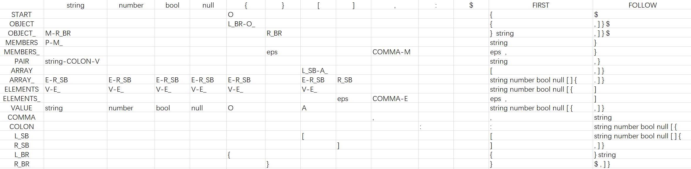

# Introduction

This is a simple Json parser with LL(1) grammatical analyze. The follow set is show in the following picture.



# How to test

```
make json_test
./json_test

make la_test
./la_test
```